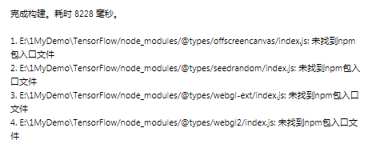
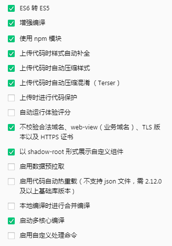

## 微信小程序使用Tensorflow JS

> 引入Tensorflow模块，实现人脸识别效果。 在不引用Tensorflow的前提下只能通过Camera组件监听把每帧图片发送到服务端，通过服务端来对图片做人脸检测、人脸识别，再不停的把结果返回回来，这么做不仅会出现高并发请求，而且很难达到时效性，用户体验十分差。 使用Tensorflow可以做到在前端检测人脸，在识别到人脸之后只需要向服务端发送一次检测到人脸的图片进行匹配，这样就可以解决实时检测人脸的同时又减轻了服务端的负担。

### 环境搭建

1. 打开微信小程序管理后台，在 `设置-第三方设置-插件管理-添加插件` 搜索 `TensorFlowJS` 并添加；
2. 在app.json文件中引入插件插件代码包

	```
	"plugins": {
	  "tfjsPlugin": {
	    "version": "0.1.0",
	    "provider": "wx6afed118d9e81df9"
	  }
	}
	```
3. 需要用npm加载需要用到的Tensorflow的js包以及模块包
	> npm安装命令： `npm install`

	> npm的package.json文件如下：

	```
	{
	  "name": "tensorflow",
	  "version": "1.0.0",
	  "description": "",
	  "main": "app.js",
	  "scripts": {
	    "test": "echo \"Error: no test specified\" && exit 1"
	  },
	  "author": "",
	  "license": "ISC",
	  "dependencies": {
	    "@tensorflow-models/blazeface": "^0.0.7",
	    "@tensorflow-models/body-pix": "^2.0.5",
	    "@tensorflow-models/coco-ssd": "^2.1.0",
	    "@tensorflow-models/posenet": "^2.2.2",
	    "@tensorflow/tfjs-backend-cpu": "^2.6.0",
	    "@tensorflow/tfjs-backend-webgl": "^2.6.0",
	    "@tensorflow/tfjs-converter": "^2.6.0",
	    "@tensorflow/tfjs-core": "^2.6.0",
	    "fetch-wechat": "^0.0.3"
	  }
	}
	```
4. 在微信开发者工具中对已经安装好的npm包进行构建，点击 `菜单栏工具-构建npm`，构建后会出现以下提示，但是不影响小程序运行。

	

5. 微信开发者工具点击右上角 `详情-本地配置` 配置图如下：

	

6. 在app.js文件中的onLaunch钩子函数里调用configPlugin函数

	```
	var fetchWechat = require('fetch-wechat');
	var tf = require('@tensorflow/tfjs-core');
	var webgl = require('@tensorflow/tfjs-backend-webgl');
	var cpu = require('@tensorflow/tfjs-backend-cpu');
	var plugin = requirePlugin('tfjsPlugin');
	
	App({
	  onLaunch: function () {
	    this.getDeviceInfo();
	    tf.ENV.flagRegistry.WEBGL_VERSION.evaluationFn = () => { return 1 };
	    plugin.configPlugin({
	      // polyfill fetch function
	      fetchFunc: fetchWechat.fetchFunc(),
	      // inject tfjs runtime
	      tf,
	      // inject webgl backend
	      webgl,
	      // inject cpu backend
	      cpu,
	      // provide webgl canvas
	      canvas: wx.createOffscreenCanvas()
	    });
	  }
	})
	```

### Tensorflow模型

> 目前只收集部分模型，可把模型文件放在自己的服务器上。 [点击打开](models/)
> 
> 需要其他模型可以去Tensorflow github地址查看，[地址](https://github.com/tensorflow/tfjs-wechat)

### 微信小程序 Tensorflow Demo

> [点击打开](miniProgram/)